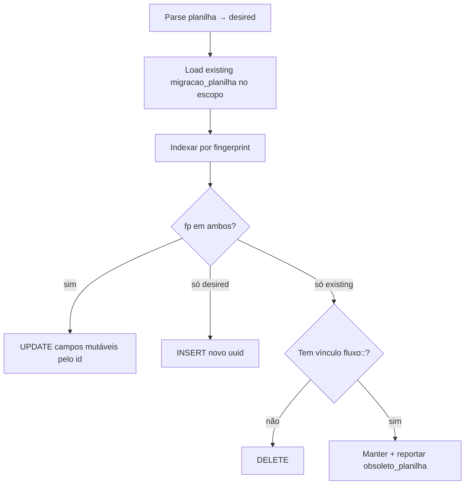

# Sync incremental do Fluxo — design

Data: 2026-09-01  
Status: **Fase 1 implementada** (plan + service + CLI). Dry-run obrigatório antes de gravar em produção.

## Problema

`npm run migrate:fluxo-operacional` é **destrutivo** para pagamentos do ano:

1. `DELETE` de todos os pagamentos `origem=migracao_planilha` no ano
2. `INSERT` com **UUIDs novos**
3. Remap pós-fato (fingerprint + heurística + sticky) — **best-effort**, não garantido

Na prática (set/2026): remigração deixou **83 órfãos**; recuperação automática resolveu **36**; **47** ainda precisam de intervenção ou novo match.

**Regra de ouro:** rotina operacional **nunca** mais roda remigração completa do ano. Só sync incremental ou escopos mínimos.

## Objetivo

Novo comando `sync:fluxo-incremental` que:

| Operação | Comportamento |
|----------|----------------|
| Pagamento já existe (mesma identidade) | **UPDATE in-place** — **UUID preservado** |
| Pagamento novo na planilha | **INSERT** |
| Pagamento sumiu da planilha | **DELETE** só se sem vínculo; senão marcar e reportar |
| Aluno novo / linha nova (ex. Jazz) | **UPSERT** em `fluxo_alunos_operacionais` |
| Overlays do app | **Preservados** (mesma lógica de `fluxoRemigracaoOverlays`) |
| `origem=sistema_editor` | **Nunca toca** |

Vínculos `validacao_pagamentos_vinculos` (`fluxo::<uuid>`) deixam de quebrar na rotina.

## Não-objetivos (v1)

- Substituir edição manual no app (`sistema_editor`)
- Sync automático agendado (n8n/cron) — só CLI/admin na v1
- Remapear os **47 órfãos** restantes (job separado já existe: `recuperar:vinculos-orfaos`)
- Mudar parser de planilha além do escopo pedido (ex. `linhaLimiteAtivos` do Jazz = sync de alunos + ajuste pontual no parser)

---

## Identidade estável

Reutilizar `fluxoPagamentoFingerprint` (`backend/src/logic/fluxoPagamentoFingerprint.ts`):

```
aba | modalidade | linha | ordem | aluno | data | forma | valor | mes_comp | ano_comp
```

É a mesma chave usada hoje no remap pós-remigração — alinhada ao `UNIQUE` da tabela.

### Coluna opcional (fase 2, não bloqueia v1)

```sql
ALTER TABLE fluxo_pagamentos_operacionais
  ADD COLUMN IF NOT EXISTS planilha_fingerprint text;
CREATE INDEX IF NOT EXISTS idx_fluxo_pag_fp
  ON fluxo_pagamentos_operacionais(planilha_fingerprint)
  WHERE origem = 'migracao_planilha';
```

Na v1 o fingerprint é calculado em memória. A coluna acelera diff e debug.

---

## Modos de execução

```bash
# Rotina recomendada — ano inteiro, pagamentos + alunos
npm run sync:fluxo-incremental -- 2026
npm run sync:fluxo-incremental -- 2026 --dry-run

# Só cadastro (novas modalidades / linhas — ex. Jazz BYLA DANÇA)
npm run sync:fluxo-incremental -- --alunos-only

# Escopo reduzido
npm run sync:fluxo-incremental -- 2026 --abas="BYLA DANÇA,YOGA"
```

| Modo | Alunos | Pagamentos | Uso |
|------|--------|------------|-----|
| default | upsert + overlays | diff incremental | Atualização mensal / pós-planilha |
| `--alunos-only` | upsert + overlays | **não mexe** | Parser ganhou linhas ativas novas |
| `--abas=...` | só abas listadas | só abas + ano | Correção cirúrgica |

`migrate:fluxo-operacional` permanece para **recuperação catastrófica**, com aviso forte no README/CLI. Não usar na rotina.

---

## Fluxo — alunos (`fluxo_alunos_operacionais`)

### Hoje (ruim)

```
DELETE origem=migracao_planilha  →  upsert tudo
```

Perde metadados de linha órfã e força reprocessamento pesado.

### Proposto

```
1. Parse planilha → desiredAlunos[]
2. Carregar overlays existentes (ativo, regime, pendências, cobrança)
3. aplicarOverlaysNaMigracao(desired, overlays)
4. UPSERT onConflict (aba, linha_planilha)
5. Linhas no DB (migracao_planilha) que não vieram no parse:
   - se overlay ativo=false → manter
   - senão → ativo=false (sumiu da planilha), reportar em removidosDaPlanilha
```

**Não deletar** alunos com histórico de pagamento/vínculo — só marcar inativo.

Parser (`linhaLimiteAtivos`, etc.) continua sendo ajuste de código separado; o sync só reflete o que o parser devolve.

---

## Fluxo — pagamentos (`fluxo_pagamentos_operacionais`)

### Algoritmo (função pura + persistência)



**Campos mutáveis no UPDATE:** `valor`, `forma`, `data_pagamento`, `mes_competencia`, `ano_competencia`, `responsaveis`, `pagador_pix`, `raw_pagamento`, `modalidade`, `aluno_nome` (se planilha corrigiu typo).

**Campos imutáveis:** `id`, `origem`, `aba`, `linha_planilha`, `ordem_lancamento` (só muda em colisão UNIQUE legítima).

### `ordem_lancamento`

O migrate atual recalcula ordem por `(aba, linha)` a cada run — isso **muda fingerprint** se a ordem dos lançamentos na planilha mudar.

No incremental:

1. Montar `desired` com a mesma regra de ordem do migrate (compatibilidade)
2. Casar primeiro por fingerprint **ignorando ordem** (fp′ sem ordem) para achar UPDATE quando só a ordem mudou
3. Só incrementar ordem em INSERT quando bater no UNIQUE

Isso reduz falsos “delete + insert”.

### Remoções

| Situação | Ação |
|----------|------|
| Sumiu da planilha, sem vínculo `fluxo::` | `DELETE` |
| Sumiu da planilha, com vínculo | **não deletar**; opcional `origem=obsoleto_planilha` (v1: só reportar) |
| `origem≠migracao_planilha` | ignorar |

### Escopo de leitura do DB

Filtro: `origem=migracao_planilha` + `ano_competencia=ano` (ou `data_pagamento` no ano) + `aba IN (...)` se `--abas`.

---

## Relação com vínculos

Com UUID estável:

- **UPDATE** → vínculo continua válido sem remap
- **INSERT** → usuário vincula na Validação (como hoje)
- **DELETE seguro** → vínculo órfão não deveria existir; se existir, reportar

**Não** chamar `recuperarVinculosAposRemigracaoFluxo` no sync incremental (só no migrate legado).

Opcional pós-sync: `recuperar:vinculos-orfaos` em dry-run para auditoria.

---

## Estrutura de código

| Arquivo | Responsabilidade |
|---------|------------------|
| `backend/src/logic/syncFluxoIncrementalPlan.ts` | Diff puro: `plannedUpdates`, `inserts`, `deletes`, `obsoletos` |
| `backend/src/services/syncFluxoIncremental.ts` | Parse + load DB + aplicar + report |
| `backend/scripts/syncFluxoIncremental.ts` | CLI |
| `backend/src/logic/syncFluxoIncrementalPlan.test.ts` | Testes com fixtures fictícios |
| `backend/package.json` | script `sync:fluxo-incremental` |

Extrair do `migrateFluxoBylaOperacional.ts` funções compartilhadas (parse alunos, parse pagamentos por aba) para um módulo `fluxoPlanilhaImport.ts` — evita duplicar com `migrateFluxoPagamentosAba.ts`.

---

## Relatório JSON (stdout)

```json
{
  "ok": true,
  "modo": "full",
  "ano": 2026,
  "abas": ["BYLA DANÇA", "YOGA"],
  "dryRun": false,
  "alunos": { "upserted": 12, "inativados": 1, "overlaysAplicados": 616 },
  "pagamentos": {
    "atualizados": 8,
    "inseridos": 15,
    "removidos": 2,
    "obsoletosComVinculo": 0,
    "inalterados": 400
  },
  "avisos": [],
  "erros": []
}
```

`--dry-run`: mesmo JSON, sem writes.

---

## Segurança e operação

- Requer `SUPABASE_SERVICE_ROLE_KEY` (igual migrate atual)
- Rota admin opcional (fase 2): `POST /api/migracao/fluxo/sync-incremental?ano=2026&dryRun=true`
- Log sem PII — só contagens e ids uuid
- Idempotente: rodar 2× seguidas → `inseridos=0`, `atualizados=0` (ou só campos que mudaram na planilha)

---

## Plano de rollout

### Fase 1 — implementar + testar local

1. `syncFluxoIncrementalPlan` + testes
2. Serviço + CLI
3. Dry-run `2026` e comparar totais com Fluxo no app

### Fase 2 — validar Jazz / BYLA DANÇA

1. Ajustar `linhaLimiteAtivos` no parser (quando combinado)
2. `sync:fluxo-incremental -- --alunos-only`
3. `sync:fluxo-incremental -- 2026 --abas="BYLA DANÇA"`

### Fase 3 — produção

1. Dry-run em prod
2. Sync real
3. `recuperar:vinculos-orfaos -- 2026 --dry-run` (auditoria dos 47 restantes)
4. Documentar no AGENTS.md: rotina = incremental; migrate = emergência

---

## Casos de teste (fixtures fictícios)

1. Pagamento idêntico → `inalterados++`, uuid igual
2. Valor mudou na planilha → `atualizados++`, uuid igual, vínculo intacto
3. Novo pagamento na linha → `inseridos++`
4. Pagamento removido sem vínculo → `removidos++`
5. Pagamento removido com vínculo → `obsoletosComVinculo++`, row mantida
6. `sistema_editor` no mesmo ano → ignorado
7. `--alunos-only` → zero mudanças em pagamentos
8. Segunda execução → tudo inalterado

---

## Riscos conhecidos

| Risco | Mitigação |
|-------|-----------|
| Fingerprint muda porque `ordem_lancamento` mudou | Match secundário sem ordem; reportar em avisos |
| Aluno mudou de `linha_planilha` na planilha | Tratado como aluno novo + antigo inativado; vínculos antigos podem precisar remap manual |
| Duas remigrações legadas já corromperam dados | `recuperar:vinculos-orfaos` + revisão manual dos 47; incremental não retroage |
| Parser e DB divergem em competência | Fingerprint inclui competência; UPDATE só se match; senão INSERT novo |

---

## Decisão: migrate vs incremental

| Cenário | Comando |
|---------|---------|
| Planilha atualizou valores / novos PIX do mês | `sync:fluxo-incremental -- 2026` |
| Nova turma/modalidade (só cadastro) | `sync:fluxo-incremental -- --alunos-only` (+ parser se necessário) |
| Uma aba com problema | `sync:fluxo-incremental -- 2026 --abas="YOGA"` |
| Banco zerado / disaster recovery | `migrate:fluxo-operacional` **uma vez**, depois só incremental |

---

## Próximo passo

Com OK explícito: implementar **Fase 1** (plan + service + CLI + testes), dry-run em `2026`, revisar diff com você antes de sync real em produção.
